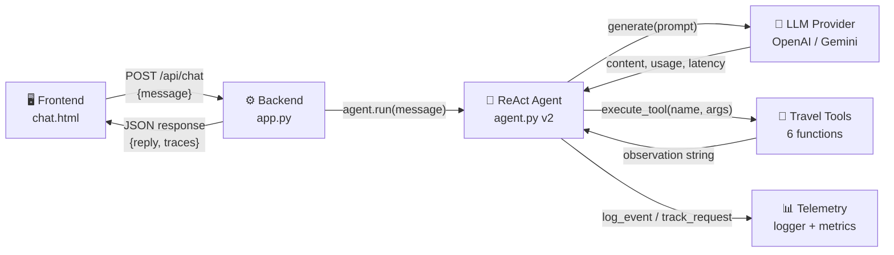
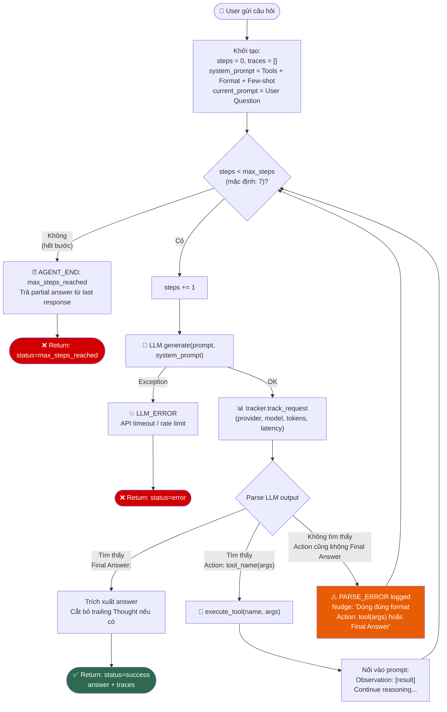
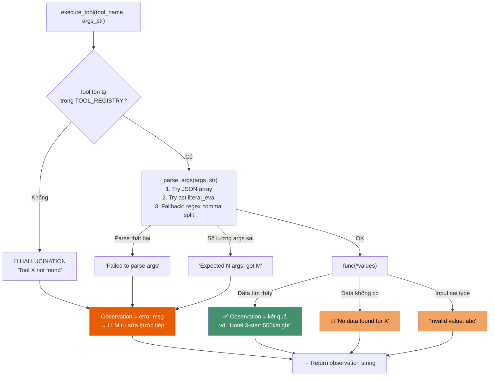

# 🔄 Flowchart: ReAct Travel Planner Agent — Luồng Xử Lý

## 1. Tổng quan kiến trúc



---

## 2. Luồng chính: ReAct Loop



---

## 3. Tool Execution — Chi tiết gọi tool



---

## 4. Bảng Error Handling tổng hợp

| # | Loại lỗi | Thời điểm | Agent xử lý | Log Event |
|:--|:---|:---|:---|:---|
| 1 | **LLM API Error** | `generate()` throw exception | Return status=error, dừng | `LLM_ERROR` |
| 2 | **Parse Error** | Output LLM không theo format | Nudge prompt, retry | `PARSE_ERROR` |
| 3 | **Tool Hallucination** | LLM gọi tool không tồn tại | Observation trả danh sách tool → LLM tự sửa | `AGENT_TOOL_CALL` |
| 4 | **Wrong Arg Count** | LLM truyền sai số args | Observation: "Expected 3, got 1" → LLM retry | `AGENT_TOOL_CALL` |
| 5 | **Invalid Arg Value** | Sai type (vd: nights="abc") | Tool trả error message cụ thể | `AGENT_TOOL_CALL` |
| 6 | **Data Not Found** | City/combo không trong DB | Tool trả "No data for X" | `AGENT_TOOL_CALL` |
| 7 | **Max Steps** | Chạy quá 7 bước | Dừng, trả partial answer | `AGENT_END` |
| 8 | **Infinite Loop** | LLM lặp cùng action | Max steps tự cắt | `AGENT_END` |

---

## 5. Use Case Traces (5 kịch bản test)

### TC1 — Multi-step: Đà Nẵng 3 ngày, 5 triệu, biển (Agent thắng)

```
User: "I want to go to Da Nang for 3 days, budget 5 million VND, I like beach."

Step 1 │ Thought: Look up Da Nang info
       │ Action: search_destination(Da Nang)
       │ Obs: "Da Nang is in central vietnam... my khe beach..."

Step 2 │ Thought: User likes beach, search beach attractions
       │ Action: search_attraction(Da Nang, beach)
       │ Obs: "1. My Khe Beach (free) 2. Ba Na Hills (~900k) 3. Cham Islands (~500k)"

Step 3 │ Thought: Estimate hotel cost for 3 nights, 3-star fits budget
       │ Action: get_hotel_price(Da Nang, 3, 3)
       │ Obs: "500,000/night × 3 = 1,500,000 VND"

Step 4 │ Thought: Estimate food, mid-range
       │ Action: estimate_food_cost(Da Nang, 3, mid)
       │ Obs: "300,000/day × 3 = 900,000 VND"

Step 5 │ Thought: Total = 1.5M + 0.9M + 1.4M = 3.8M. Check budget
       │ Action: check_budget(3800000, 5000000)
       │ Obs: "Remaining: 1,200,000 VND"

Step 6 │ Final Answer: "Lịch trình 3 ngày Đà Nẵng..."
       │ Status: ✅ success (6 steps)
```

### TC2 — Budget Overflow: Phú Quốc 5 sao, 1 triệu (Cảnh báo)

```
User: "I only have 1 million VND, Phu Quoc 3 nights, 5-star hotel."

Step 1 │ Action: search_destination(Phu Quoc)
       │ Obs: "Phu Quoc... southern island... long beach..."

Step 2 │ Action: get_hotel_price(Phu Quoc, 5, 3)
       │ Obs: "2,500,000/night × 3 = 7,500,000 VND"

Step 3 │ Action: check_budget(7500000, 1000000)
       │ Obs: "Over budget: 6,500,000 VND" ❌

Step 4 │ Final Answer: "Ngân sách 1 triệu không đủ cho 5 sao Phú Quốc.
       │  Gợi ý: hạ xuống 3 sao (700k/đêm = 2.1tr tổng)."
       │ Status: ✅ success (4 steps)
```

### TC3 — Simple Query: Thời tiết Sapa T12 (Hòa với Chatbot)

```
User: "What's the weather in Sapa in December?"

Step 1 │ Action: get_weather(Sapa, 12)
       │ Obs: "5-15C, cold and dry, warm clothes recommended."

Step 2 │ Final Answer: "Sapa in December is 5-15°C, cold and dry..."
       │ Status: ✅ success (2 steps) — nhưng chatbot cũng trả lời được!
```

### TC4 — So sánh 2 nơi: Hội An vs Nha Trang (Multi-step phức tạp)

```
User: "I have 7 million, 4 days, culture. Hoi An or Nha Trang?"

Step 1 │ Action: search_destination(Hoi An)
       │ Obs: "ancient town, lantern streets..."

Step 2 │ Action: search_destination(Nha Trang)
       │ Obs: "beaches, vinwonders..."

Step 3 │ Action: search_attraction(Hoi An, culture)
       │ Obs: "Ancient Town ticket, Japanese Bridge, Lantern boat"

Step 4 │ Action: search_attraction(Nha Trang, adventure) ← chuyển vì Nha Trang không có culture
       │ Obs: "Scuba dive, Island hopping, VinWonders"

Step 5 │ Action: get_hotel_price(Hoi An, 4, 4) + get_hotel_price(Nha Trang, 4, 4)
       │ Obs: "Hoi An 4*: 3M" / "Nha Trang 4*: 3.4M"

Step 6 │ Final Answer: "So sánh... Hội An phù hợp hơn cho culture,
       │  tổng ước 5.5M < 7M budget..."
       │ Status: ✅ success
```

### TC5 — Ambiguous Input: Thiếu thành phố (Edge case)

```
User: "I want to go to the beach, about 3 days."

Step 1 │ Thought: User didn't specify city. I'll search a popular beach city.
       │ Action: search_destination(Da Nang)
       │ Obs: "Da Nang... my khe beach..."
       │
       │ HOẶC:
       │ Thought: Not enough info, I should provide Final Answer asking for city.
       │ Final Answer: "Bạn chưa nêu rõ thành phố. Gợi ý: Da Nang, Nha Trang, Phu Quoc..."
       │
       │ Status: Tùy thuộc LLM xử lý — cả 2 đều OK
```

---

## 6. So sánh Agent v1 vs v2

| Tiêu chí | v1 (Nhân) | v2 (Hưng) |
|:---|:---|:---|
| **System prompt** | Ngắn gọn, chung chung | Few-shot travel example, strict format |
| **Return type** | `str` (chỉ answer) | `Dict` (answer + traces + steps + status) |
| **Metrics tracking** | Không | `tracker.track_request()` mỗi step |
| **Parse error recovery** | Nudge nhưng chưa log | Log `PARSE_ERROR` + nudge cụ thể |
| **Action parsing** | 1 pattern | 2 patterns (parentheses + JSON) |
| **Thought extraction** | Không | Regex extract cho trace |
| **FE ready** | Không | Traces → API → JS hiển thị |
