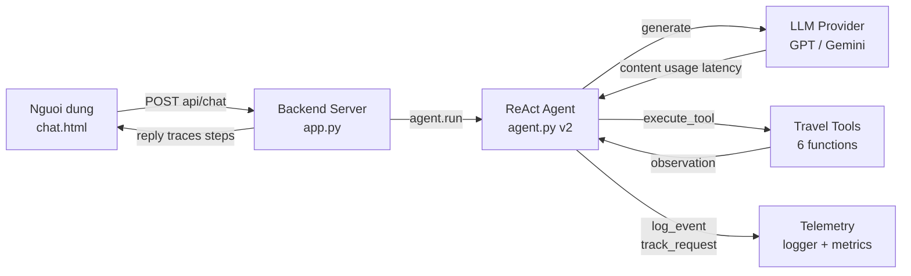
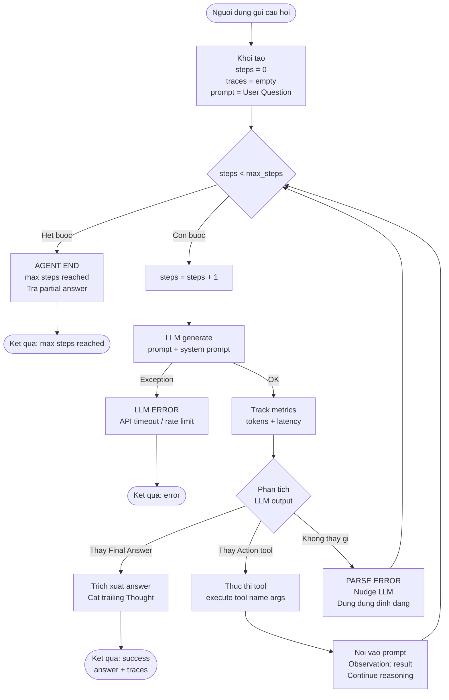
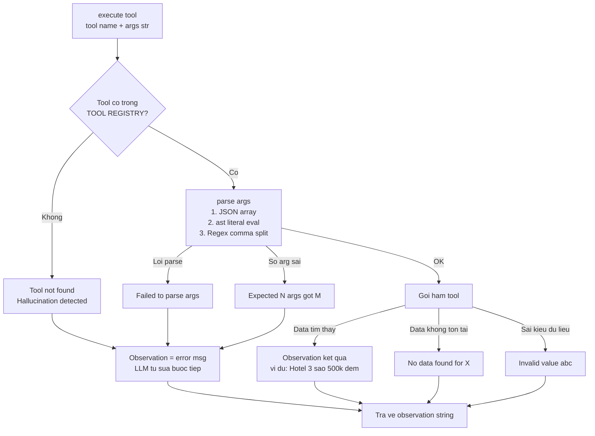
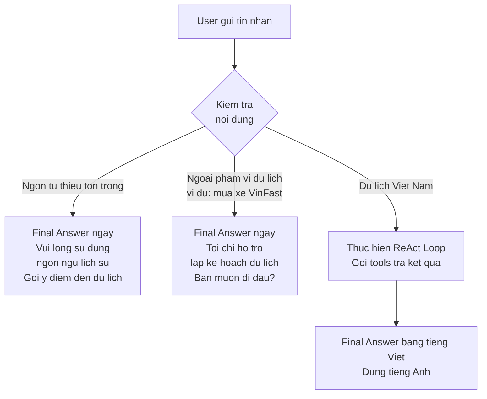

# Flowchart: ReAct Travel Planner Agent

## Diagram 1: Kien truc tong quan

---

## Diagram 2: ReAct Loop chinh

---

## Diagram 3: Xu ly tool va loi

---

## Diagram 4: Domain Guardrail

---

## Diagram 5: 5 Use Case luong chay

```mermaid
flowchart LR
    subgraph TC1 [TC1 Multi step Da Nang thang]
        direction TB
        t1a[search destination Da Nang]
        t1b[search attraction Da Nang beach]
        t1c[get hotel price Da Nang 3 3]
        t1d[estimate food cost Da Nang 3 mid]
        t1e[check budget 3800000 5000000]
        t1a --> t1b --> t1c --> t1d --> t1e
    end

    subgraph TC2 [TC2 Budget tran Phu Quoc 5 sao]
        direction TB
        t2a[search destination Phu Quoc]
        t2b[get hotel price Phu Quoc 5 3]
        t2c[check budget 7500000 1000000]
        t2d[VUOT NGAN SACH 6.5 trieu]
        t2a --> t2b --> t2c --> t2d
    end

    subgraph TC3 [TC3 Cau don gian Sa Pa]
        direction TB
        t3a[get weather Sapa 12]
        t3b[Final Answer 5-15 do C]
        t3a --> t3b
    end

    subgraph TC4 [TC4 So sanh 2 noi]
        direction TB
        t4a[search destination Hoi An]
        t4b[search destination Nha Trang]
        t4c[search attraction Hoi An culture]
        t4d[get hotel price x2]
        t4e[So sanh ket qua]
        t4a --> t4b --> t4c --> t4d --> t4e
    end

    subgraph TC5 [TC5 Input mo ho]
        direction TB
        t5a[Khong co ten thanh pho]
        t5b[Final Answer ngay\nGoi y Da Nang\nPhu Quoc Hoi An]
        t5a --> t5b
    end
```

