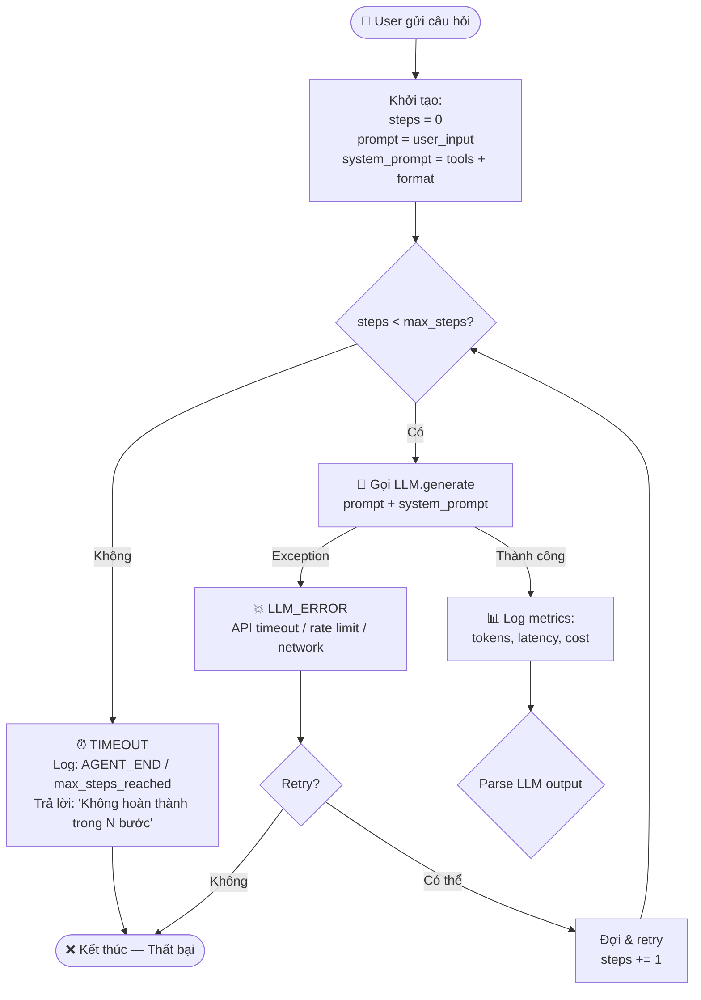
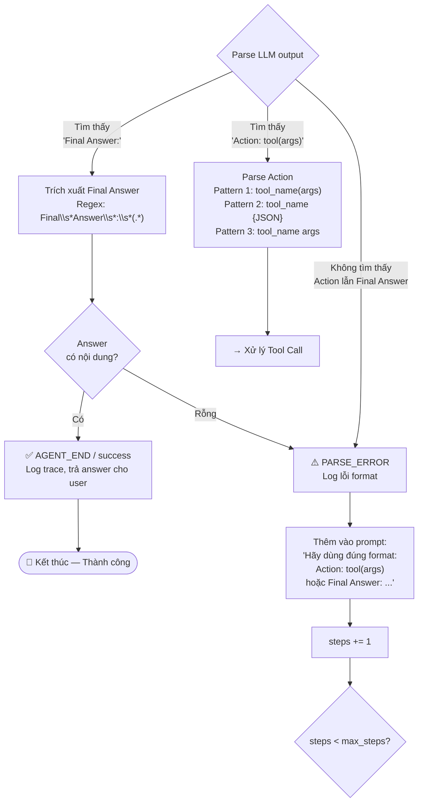
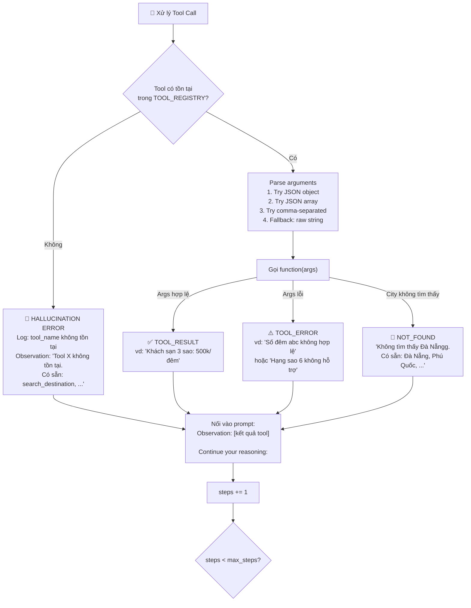

# 🔄 Flowchart: ReAct Agent — Luồng Xử Lý Toàn Diện

## 1. Luồng chính: User → Final Answer



---

## 2. Parsing LLM Output — Phân loại response



---

## 3. Tool Execution — Gọi Tool & Xử lý kết quả



---

## 4. Sơ đồ tổng hợp — Full Flow (1 diagram)

```mermaid
flowchart TD
    U(["👤 User: 'Đi Đà Nẵng 3 ngày, 5 triệu, thích biển'"])
    
    U --> S["System Prompt:<br/>6 tools + format ReAct + few-shot"]
    S --> L{"🔁 Bước < Max?"}
    
    L -->|Hết bước| TO["⏰ Timeout → trả partial answer"]
    
    L -->|Còn| LLM["🧠 LLM Generate"]
    LLM -->|Lỗi API| ERR1["💥 Log error → retry/stop"]
    
    LLM -->|OK| P{"Có gì trong output?"}
    
    P -->|Final Answer| FA["✅ Trả lời user"]
    
    P -->|Action: tool_name(args)| T{"Tool tồn tại?"}
    T -->|Không| H["🤖 Hallucination<br/>Obs: Tool ko tồn tại"]
    T -->|Có| CALL["🔧 Gọi tool"]
    CALL -->|Lỗi args| E2["Obs: Lỗi input"]
    CALL -->|Lỗi data| E3["Obs: Không tìm thấy"]
    CALL -->|OK| OK["Obs: Kết quả"]
    
    P -->|Không parse được| NP["⚠️ Parse Error<br/>Obs: Dùng đúng format!"]
    
    H --> AP["📝 Nối Observation vào prompt"]
    E2 --> AP
    E3 --> AP
    OK --> AP
    NP --> AP
    AP --> L
    
    style FA fill:#2d6a4f,color:#fff
    style TO fill:#d00000,color:#fff
    style ERR1 fill:#d00000,color:#fff
    style H fill:#e85d04,color:#fff
    style NP fill:#e85d04,color:#fff
    style E2 fill:#f4a261,color:#000
    style E3 fill:#f4a261,color:#000
    style OK fill:#40916c,color:#fff
```

---

## 5. Bảng Error Handling tổng hợp

| Loại lỗi | Khi nào xảy ra | Cách xử lý | Log Event |
|:---|:---|:---|:---|
| **LLM API Error** | API timeout, rate limit, network | Retry 1 lần hoặc stop, trả error | `LLM_ERROR` |
| **Parse Error** | LLM output không theo format Thought/Action/Final Answer | Nudge: thêm hướng dẫn format vào prompt → retry | `PARSE_ERROR` |
| **Hallucination** | LLM gọi tool không tồn tại | Observation trả danh sách tool hợp lệ → LLM tự sửa | `TOOL_CALL` + obs error |
| **Invalid Args** | Sai kiểu dữ liệu (vd: star="6", nights="abc") | Tool trả error message cụ thể → LLM điều chỉnh | `TOOL_RESULT` + error msg |
| **Data Not Found** | City/data không có trong mock DB | Trả danh sách available → LLM thử lại hoặc thông báo user | `TOOL_RESULT` + not found |
| **Max Steps** | Agent chạy quá max_steps (7) | Dừng loop, trả partial answer | `AGENT_END` / max_steps |
| **Infinite Loop** | LLM lặp cùng 1 Thought/Action | Max steps tự cắt → log giúp phát hiện | `AGENT_END` / max_steps |

---

## 6. Ví dụ Trace thành công (5 bước)

```
User: "Đi Đà Nẵng 3 ngày, ngân sách 5 triệu, thích biển"

Step 1 │ Thought: Cần tìm info Đà Nẵng
       │ Action: search_destination(Đà Nẵng)
       │ Observation: "Đà Nẵng (Miền Trung): biển Mỹ Khê, Bà Nà Hills..."
       │
Step 2 │ Thought: User thích biển → tìm địa điểm beach
       │ Action: search_attraction(Đà Nẵng, beach)
       │ Observation: "1. Mỹ Khê (free) 2. Sơn Trà (free) 3. Bà Nà (900k)"
       │
Step 3 │ Thought: Tính khách sạn ngân sách trung bình → 3 sao
       │ Action: get_hotel_price(Đà Nẵng, 3, 3)
       │ Observation: "500k/đêm × 3 = 1,500,000 VNĐ"
       │
Step 4 │ Thought: Tính ăn uống mức mid
       │ Action: estimate_food_cost(Đà Nẵng, 3, mid)
       │ Observation: "300k/ngày × 3 = 900,000 VNĐ"
       │
Step 5 │ Thought: Tổng = 1.5tr + 0.9tr + 0.9tr(vé) = 3.3tr. Check budget
       │ Action: check_budget(3300000, 5000000)
       │ Observation: "Tổng 3.3tr / Budget 5tr → Dư 1.7tr ✅"
       │
Step 6 │ Thought: Đủ info, tổng hợp lịch trình
       │ Final Answer: "Lịch trình 3 ngày Đà Nẵng: ..."
```

## 7. Ví dụ Trace thất bại (Parse Error → Recovery)

```
User: "Giá khách sạn 4 sao ở Hội An 2 đêm"

Step 1 │ Thought: Tôi cần check giá khách sạn
       │ (LLM output lỗi format — không có Action:)
       │ → PARSE_ERROR logged
       │ Observation: "Hãy dùng đúng format: Action: tool_name(args)"
       │
Step 2 │ Thought: Để tôi gọi tool đúng format
       │ Action: get_hotel_price(Hội An, 4, 2)
       │ Observation: "4 sao Hội An: 750k/đêm × 2 = 1,500,000 VNĐ"
       │
Step 3 │ Final Answer: "Khách sạn 4 sao Hội An 2 đêm: 1,500,000 VNĐ"
```
